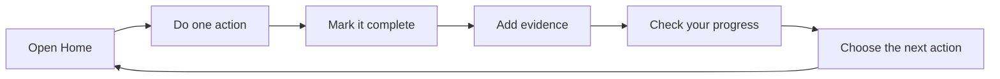

# How to use the platform

This guide is for members. Think of the platform as a simple place to choose a goal, take small steps, and see your progress.

## The five buttons you will use most

| Button | What it does |
| --- | --- |
| **Home** | Shows your next step, upcoming sessions, learning, and reminders. |
| **Goals** | Shows every goal you have. |
| **Learn** | Shows lessons, videos, audio, PDFs, and quizzes. |
| **Mentor** | Shows your mentor, messages, and sessions. |
| **Profile** | Shows your personal details and settings. |

You may also see **Notifications**, **Help**, and **Account** at the top of the screen. On a phone, use **More** to find extra pages.

## Your first visit

1. Choose **Register**.
2. Enter your details and choose **Continue**.
3. Enter the verification code.
4. Complete the short setup questions.
5. If you are under 18, invite your guardian and wait for consent.
6. Create your first goal.
7. Add a few small actions that will help you reach it.

When setup is finished, choose **Home**. The page will show the next useful thing to do.

## When you come back

Start at **Home**. You may see buttons such as:

- **Start Next Action** — do the next small step.
- **Complete Action** — tell the platform that you finished it.
- **Add Evidence** — add a note, link, or file that shows what you did.
- **Adjust Plan** — change the plan if life or your goal changes.
- **Complete Evaluation** — pause and think about what is working.

If you already know what you want, use the five main buttons at the top or bottom of the screen.

## How to check your goals and progress

1. Choose **Goals**.
2. Search for a goal or choose a status such as **active**, **paused**, **achieved**, or **archived**.
3. Choose **View Goal**.
4. Use the goal tabs:
   - **Overview** — the big picture and your progress number.
   - **Plan** — what success means and the milestones.
   - **Actions** — the steps you planned to take.
   - **Check-ins** — what happened on each scheduled day.
   - **Evaluations** — your reflections and decisions.
   - **Evidence** — proof of your work.
   - **Interventions** — extra help when a goal is at risk.

To update progress, choose **Record Progress**, select the milestone, enter your new amount, and save.

## How to learn

1. Choose **Learn**.
2. Search or filter by category.
3. Choose **View Learning**.
4. Read, watch, or listen to the lesson.
5. Choose **Mark Complete** when you finish.
6. If there is a quiz, choose **Submit Quiz**.

Choose **My Learning** to see the lessons you have started or finished.

## How credits work

Credits are used for learning materials that need them.

1. Choose **Credits** or **Payments**.
2. Check your balance.
3. Choose **Add Credits** if you need more.
4. After getting credits, return to **Learn** and open the material.

Your credit history shows credits added and credits used. Always check the material and price before confirming.

## How to use mentorship

1. Choose **Mentor**.
2. Open an upcoming session with **Open Session**.
3. Check the date, time, and plan for the session.
4. Use **Messages** when you need to communicate.
5. After a session, complete any action or evaluation your mentor suggested.

## A simple weekly habit

The aim is not to finish everything at once. Do one useful step, record it, and come back for the next step.

## If you get stuck

- Choose **Help** for guidance.
- Choose **Notifications** to see reminders.
- Choose **Account → Profile** to check your details.
- Choose **Account → Log out** when you are finished.
