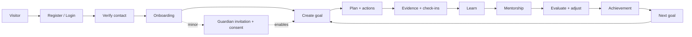
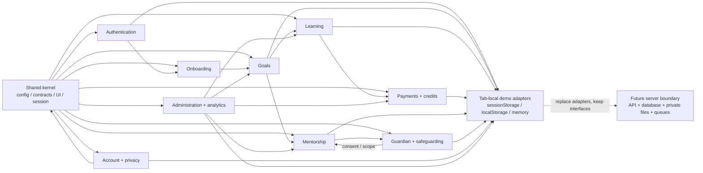

# Project architecture map

This is the compact, current-state map of the Goal Achievement Platform. It focuses on the connections that explain how a request travels through the app rather than listing every screen.

## 1. Product journey



## 2. Application map

```mermaid
flowchart TB
  Browser[Browser]
  Layout[app/layout.tsx\nMarketing chrome + global styles]
  Public[app/page.tsx + app/[...slug]/page.tsx\nPublic pages + special flows]
  Member[app/app/[[...path]]/page.tsx\nMember portal dispatcher]
  Portal[PortalShell\nNavigation + session gate]
  Routes[portal/routes.ts\nRoute matching + visible routes]
  Permissions[portal/permissions.ts\nRole grants + scope checks]

  Browser --> Layout
  Layout --> Public
  Layout --> Member
  Public -->|login / register| Auth[authentication]
  Public -->|onboarding| Onboarding[onboarding]
  Public -->|guardian invitation| Guardian[guardian]
  Public -->|mentor application| Mentorship[mentorship]
  Member --> Portal
  Public --> Portal
  Portal --> Routes
  Portal --> Permissions
  Portal --> MemberDomains[Member domains]

  subgraph MemberDomains[Role portals]
    Goals[goals]
    Learning[learning]
    Payments[payments]
    Mentor[mentorship portal]
    Account[account]
    GuardianPortal[guardian portal]
    Admin[administration]
  end

  MemberDomains --> Shared[shared kernel]
  Shared[shared kernel\nconfig · contracts · UI · demo services]
```

## 3. Domain and data connections



## Reading the map

- Start: `app/layout.tsx` and the two route dispatchers.
- Control point: `PortalShell`, `portal/routes.ts`, and `portal/permissions.ts`.
- Core journey: onboarding → goals → learning/payments/mentorship → evaluation/achievement.
- Shared dependency: `domains/shared/` supplies configuration, contracts, UI, and demo session/services.
- Current endpoint: tab-local demonstration adapters. No production backend is connected yet.
- Intended endpoint: server-validated API implementations behind the existing typed contracts.
